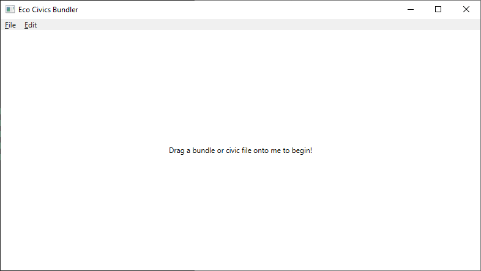
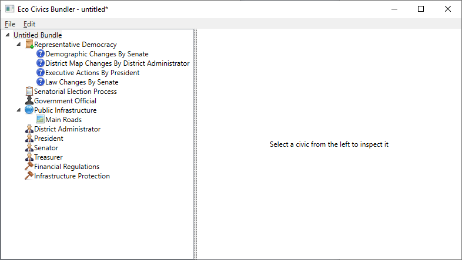
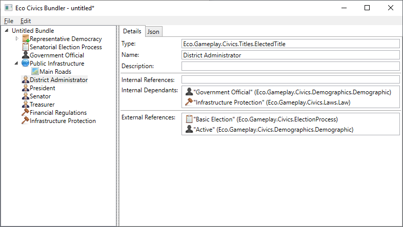

# Eco Civics Import Export Mod
A server mod for Eco 9.7 that allows admins to export the supported civics (listed below) from a server to json files, where they can be copied to another server and re-imported.

Supported objects:
- Laws
- Election Processes
- Elected Titles
- Appointed (Registrar) Titles
- Demographics
- Constitutional Amendments
- District Maps (only compatible when the world size is equivalent)
- Government Bank Accounts

## Installation
1. Download `EcoCivicsImportExportMod.dll` from the [latest release](https://github.com/thomasfn/EcoCivicsImportExportMod/releases).
2. Copy the `EcoCivicsImportExportMod.dll` file to `Mods` folder of the dedicated server.
3. Restart the server.

## Usage

All chat commands require admin privileges.

### Exporting Civics
The `export` command will serialise the specific civic object to a json file in the server's working directory, under a folder called `civics`.

`/civics export <id>`
e.g. `/civics export 10`

To find the ID of a civic, tag it in chat and hover it, the ID is displayed at the bottom of the popup.
`civictype` must be one of:
- `law`
- `electionprocess`
- `electedtitle`
- `appointedtitle`
- `demographic`
- `constitution`
- `amendment`
- `districtmap`
- `govaccount`

The filename of the exported file will be as follows (relative to the server's working directory): `civics/<civictype>-<id>.json`. The command will inform you of this filename if serialisation is successful.

You can rename the file outside of the game if you wish, as the name of the file is specified in the import command.

The `exportallof` command will serialise all civic objects of a type. It's the equivalent of running the `export` command for each civic object individually.

`/civics exportallof <civictype> [state]`
e.g. `/civics exportallof law` or `/civics exportallof law,active`

The `exportall` command will serialise all civic objects of all types. It's the equivalent of running the `exportallof` command for each civic type individually.

`/civics exportall [state]`
e.g. `/civics exportall` or `/civics exportall active`

Note that the state argument in the above commands is optional, but if present must be one of:
- `draft` (the civic has not yet been proposed)
- `proposed` (the civic is proposed and an election is running for it)
- `active` (the civic is in play)
- `removed` (the civic has been entirely removed)

For non-proposable objects, e.g. bank accounts or appointed titles, the state argument is ignored.

### Importing Civics
The import command will attempt to deserialise a civic object from the specified json file. If it fails at any stage, the civic object (if it managed to created one) will be immediately destroyed with no side effects. The file must be placed in the "civics" folder in the server's working directory. Alternatively, a download URL may be specified.

`/civics import <filename-or-url>`
e.g. `/civics import law-10.json`

The civic object will be given draft status with the command executor as the owner, and put in the first available civic slot (e.g. a law will go to the first available Court). If there are no slots available, the command will fail. The executor of the command should have civic privileges to propose changes to civics of that type, or they may not be able to actually bring the imported civic to life.

The civic object may have dependencies on other objects - for example, a law may reference a bank account or a district map, or an election process may reference a demographic. All dependencies must be present at the point of running the import command, or the command will fail. Dependencies are resolved via name - so if a law references a district called "Main Roads" and the server has a district called "Roads" instead, this will not work - either the district will need to be renamed for the dependency to be resolved, or the json file will need to be manually amended. Dependencies can be safely renamed after the import is complete.

An import can be reversed by using the undo import command.

`/civics undoimport`

This will roll back the previously executed import, deleting any objects that it created. This will not go back more than one import, and it will not roll back imports from previous sessions (e.g. since a server restart). Use this command with caution as it wipes the objects entirely from memory without any regard for how they may have changed or been referenced since being imported.

#### Government Accounts

A bank account can be exported/imported as a civic if it's created as a Government Account. In this case it will persist the holdings (e.g. how much of each currency is held in the account), but not the transactions - the imported account will show an empty transaction log. The usual rules about dependencies apply to holdings as they reference currencies - these will need to be present before import.

### Importing Bundles
A bundle is a number of civics that have been previously exported by the plugin, grouped up into a single file. This bundle can be imported via the same import command as single civics. When importing a bundle, all civics contained within the bundle are imported in one go, saving the need to run the command over and over again during workloads that involve importing a large number of civics (for example an entire government structure). Bundles can be assembled manually or using the included bundler tool (see [Bundler Tool](#bundler-tool)).

`/civics import <filename-or-url>`
e.g. `/civics import my-bundle.json`

A bundle can only be imported if all dependencies of that bundle are present beforehand. The plugin will not import _any_ civics from the bundle if some references can't be resolved. The bundle info command will print details about the bundle, including any dependencies and whether or not they could be resolved, without actually attempting an import - e.g. it is safe to run with no side effects.

`/civics bundleinfo <filename-or-url>`
e.g. `/civics bundleinfo my-bundle.json`

The bundle info command will work on single civics too, as they are just considered a bundle with one civic contained within.

### Bundler Tool
The bundler tool allows civics that have been previously exported by the plugin to be grouped together into a single bundle, ready to be imported by the plugin in one go. It has a simple UI and only works on Windows.

#### Installation
1. Download the tool from the latest release
2. Extract the zip to a location of your choosing
3. Run the executable `EcoCivicsImportExportMod.Bundler.exe`

#### Usage
When you first open the tool, you'll be presented with a clean slate.

As the tip suggests, there are multiple ways you can get started. You can open an existing bundle or create a new one via the File menu, or drag one or more civic json files onto the tool from Windows Explorer. If you choose to create a new bundle, you'll be presented with an empty untitled bundle.

In this view you can drag one or more civic json files onto the tool from Windows Explorer, or select Add to Bundle from the Edit menu to add civics to the bundle.

As you add civics to the bundle, they will display on the tree view to the left, by order of type and then name. The icons can be used to tell the civic types apart at a glance. Some civics hold sub-objects, for example a District Map may hold multiple Districts, and these can be seen by expanding the civic object node in the tree view. You can right click civics and click Remove from Bundle, or select them and click Remove Selected from Bundle in the Edit menu to remove a civic from the bundle. You can select any civic object node from the tree view to view further details.

The detail view displays key information about the civic, including any references it has to other civics (either 'Internal', that is within the bundle, or 'External', that is outside of the bundle) and any other civics within the bundle that reference the civic ('Dependants'). The name and description of the civic objects can be changed here, but all other properties are immutable.

Once the bundle has been assembled to your satisfaction, simply save it to the server's `civics` folder and the plugin's import command should be able to import it.

## Building Mod from Source

### Windows

1. Login to the [Eco Website](https://play.eco/) and download the latest modkit
2. Extract the modkit and copy the dlls from `ReferenceAssemblies` to `eco-dlls` in the root directory (create the folder if it doesn't exist)
3. Open `EcoCivicsImportExportMod.sln` in Visual Studio 2019/2022
4. Build the `EcoCivicsImportExportMod` project in Visual Studio
5. Find the artifact in `EcoCivicsImportExportMod\bin\{Debug|Release}\net7.0`

### Linux
1. Run `ECO_BRANCH="release" MODKIT_VERSION="0.9.7.10-beta" fetch-eco-reference-assemblies.sh` (change the modkit branch and version as needed)
2. Enter the `EcoCivicsImportExportMod` directory and run:
`dotnet restore`
`dotnet build`
3. Find the artifact in `EcoCivicsImportExportMod/bin/{Debug|Release}/net7.0`

## Building Bundler Tool from Source

### Windows

1. Open `EcoCivicsImportExportMod.sln` in Visual Studio 2019/2022
2. Build the `EcoCivicsImportExportMod.Bundler` project in Visual Studio
3. Find the artifact in `EcoCivicsImportExportMod.Bundler\bin\{Debug|Release}\net5.0-windows`

## Attributions
- Some icons used in the Bundler Tool are by [Yusuke Kamiyamane](http://p.yusukekamiyamane.com/) licensed under a [Creative Commons Attribution 3.0 License](http://creativecommons.org/licenses/by/3.0/).

## License
[MIT](https://choosealicense.com/licenses/mit/)